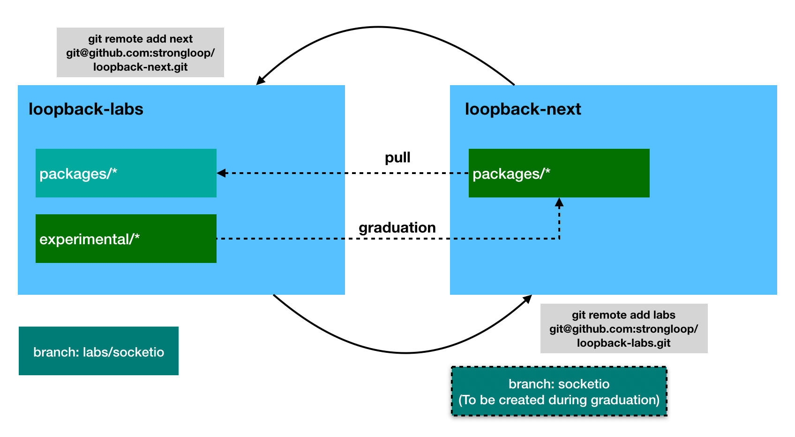

# LoopBack 4 Labs

We created `loopback-labs` monorepo to facilitate development of experimental
features without interfering with `loopback-next`.

`loopback-labs` is a logical `fork` of `loopback-next` as github does not allow
us to folk `loopback-next` into the same organization (`strongloop`).

We divide responsibilities of the two repositories as follows:

- `loopback-next`: the repository to develop and release production-ready
  features.

- `loopback-labs`: the repository to develop and release experimental features.

Two-way interactions can happen between `loopback-labs` and `loopback-next`.

1. Keep `loopback-labs` in sync with `loopback-next` for production-ready
   features by rebasing against `loopback-next@master`.

2. Graduate experimental features from `loopback-labs` into `loopback-next`.



## Create separate branch for each feature

To keep an experimental feature fully isolated and make it easy to graduate into
`loopback-next`, we should consider keep each of experimental features isolated in `loopback-labs@experimental/feature-1` branch.

## Workflow

### Work on an experimental feature in `@loopback-labs`

1. Set up local git repository for `loopback-labs`

```sh
git clone git@github.com:strongloop/loopback-labs.git
cd loopback-labs
git remote add next git@github.com:strongloop/loopback-next.git
```

2. Work on an experimental feature

- Create a feature branch `experimental/feature-1`.

  ```sh
  cd loopback-labs
  git checkout -b experimental/feature-1
  git push --force-with-lease
  ```

- Start to add changes in a dev branch, like `experimental-dev/feature-1`.

  ```sh
  cd loopback-labs
  git checkout -b experimental-dev/feature-1
  // add some change
  git add .
  git commit -m '<your commit message>'
  git push --force-with-lease
  ```
  
- Create a PR from the dev branch `experimental-dev/feature-1` into feature branch `experimental/feature-1`.
  
- Team reviews the PR.

3. Iterate step 2 until the new module is ready to graduate

### Graduate an experimental feature

1. Set up local git repository for `loopback-next`

```sh
cd loopback-next
git remote add labs git@github.com:strongloop/loopback-labs.git
```

2. Pull in the experimental feature from `loopback-labs` into `loopback-next`

```sh
cd loopback-next
git checkout -b experimental/feature-1
git fetch --all

// check-pick commits from `labs` into `experimental/feature-1` branch

// Move experimental modules from `experimental` to `packages`

// Create a PR
```
